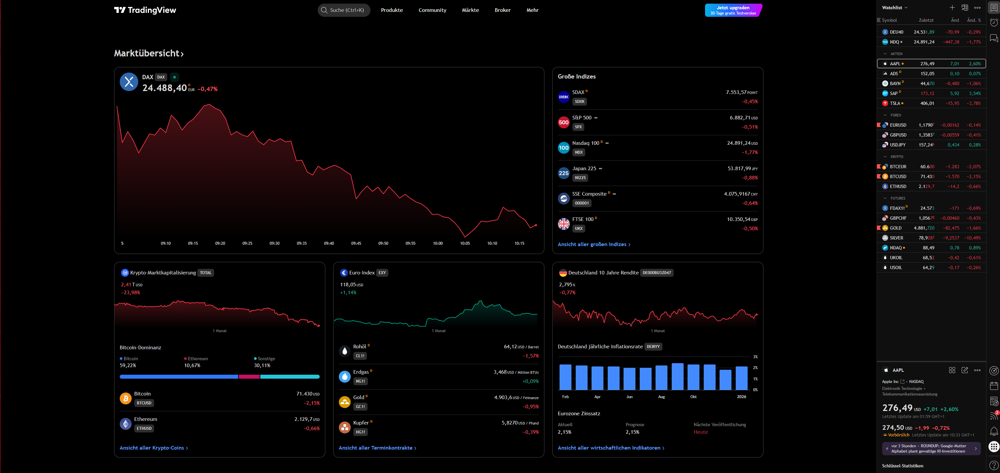
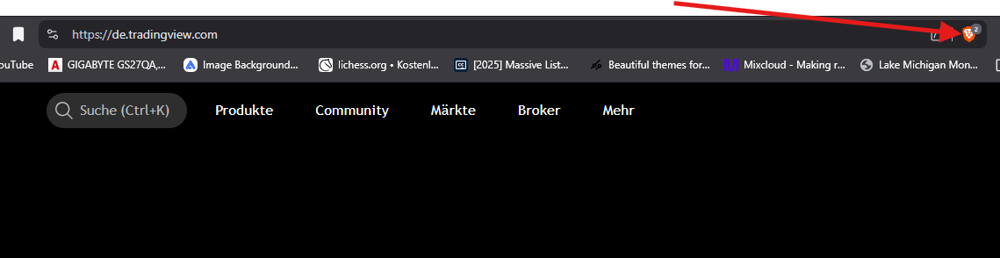
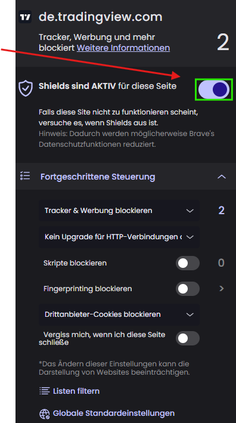
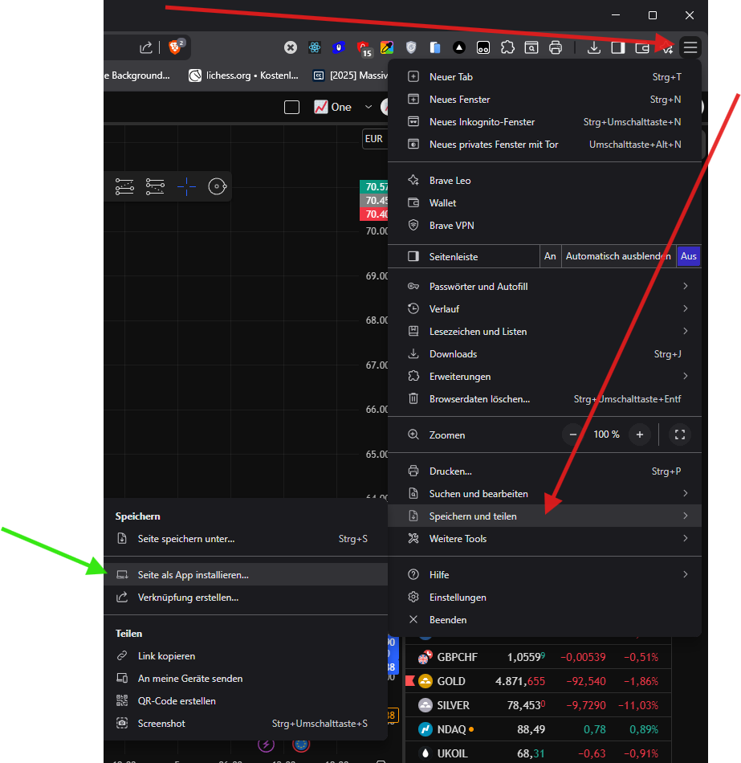

# AdBlocker for Trendingview / use WebAPP Instead of Desktop Version (with Brave AdBlock Shield)
**Brave Browser** 
-  1 Go to extension use TempermonkeyScript search at you own for the right script to use, or just use the provided Brave shield, it's simpler.
-  2 Go to Brave Tab "Customization and settings" and install the Website as an App...
<table>
  <tr>
    <td></td>
    <td></td>
    <td></td>
  </tr>
</table>
> [!NOTE]
> This project is for educational purposes only. Please support the developers of trendingview by purchasing a license if you use the software productively.
> [https://de.tradingview.com/pricing/?source=chart&feature=burger_menu_profile_info/](https://de.tradingview.com/pricing/?source=chart&feature=burger_menu_profile_info)

---
Generated with ❤️ by Icarus-B4 Deepmind Agent
